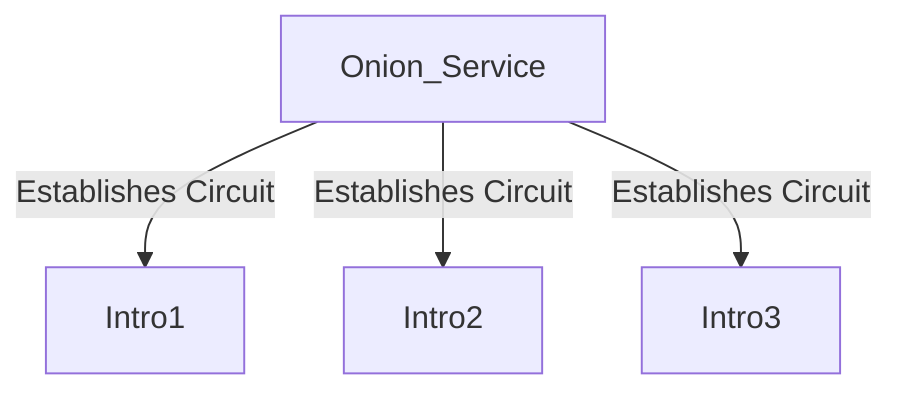
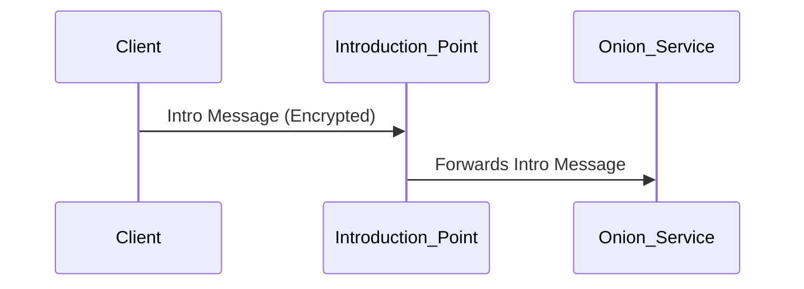
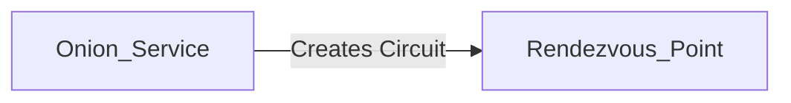
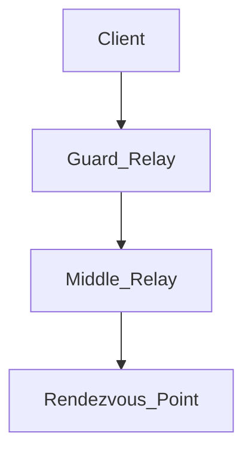
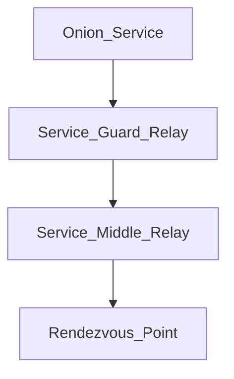

# Visual Guide to Tor Onion Services

## Step 1: Service Advertises Its Presence

The Onion Service selects several Tor relays to act as **Introduction Points** and establishes secure circuits to them.

- **Secure Circuits** are established (the lines represent Tor circuits, not direct connections).
- **Introduction Points** know the service's public key but not its IP address, preserving anonymity.

---

## Step 2: Creating the Service Descriptor

The service compiles an **Onion Service Descriptor** containing its public key and information about the introduction points.

```markdown
[Onion Service] --[Publishes Descriptor]--> [Distributed Hash Table (DHT)]
```
- The descriptor is **signed** with the service's private key for authenticity.
- Uploaded to the **DHT**, a decentralized network database accessible by clients.

---

## Step 3: Client Seeks to Connect

The client wants to access the onion service and needs to find its descriptor.

- The client retrieves the descriptor using the onion address (e.g., `XYZ.onion`).
- Now aware of introduction points and the service's public key.

---

## Step 4: Client Sets Up a Rendezvous Point

The client establishes a rendezvous point to facilitate a connection without revealing identities.

- A **one-time secret** is generated to secure the connection.
- The rendezvous point is a Tor relay chosen at random.

---

## Step 5: Client Introduces Itself to the Service

The client sends an introduction message via an introduction point.

- The message includes the rendezvous point address and the one-time secret.
- Sent over a Tor circuit to maintain the client's anonymity.

---

## Step 6: Service Connects to the Rendezvous Point

The onion service receives the introduction message and responds.

- Decrypts the introduction message to get rendezvous details.
- Connects to the rendezvous point and sends the one-time secret for verification.

---

## Step 7: Secure Communication is Established

Both parties communicate through the rendezvous point without revealing their locations.

- The rendezvous point cannot decrypt the data; it simply passes it along.
- This setup maintains **end-to-end encryption** and anonymity.

---

## Metaphorical Explanation: The Secret Pen Pals

Imagine two secret pen pals who want to exchange letters without revealing their addresses.

1. **Alice (Onion Service)** leaves her letters with trusted friends (**Introduction Points**).
2. She provides a pseudonym and a secret code (public key) to them.
3. **Bob (Client)** wants to write to Alice but only knows her pseudonym.
4. Bob consults a public directory (**DHT**) to find out where to send his letter.
5. Bob picks a random mailbox (**Rendezvous Point**) and tells Alice's friend where to forward his letter.
6. Alice retrieves Bob's letter from her friend, learns about the rendezvous mailbox, and sends her reply there.
7. They continue exchanging letters through this mailbox, never revealing their real addresses.

---

## Detailed Diagrams

### Full Connection Overview

**Client's Side:**

**Service's Side:**

- Both the client and the service use **three-hop circuits**.
  - **Guard Relay**: The first hop, providing a stable entry point.
  - **Middle Relay**: Adds an extra layer of separation.
  - **Rendezvous Point**: The common relay where both circuits meet.

---
### Communication Flow Diagram
```markdown
        [Client]                                     [Onion Service]
           |                                                |
           |-- Fetches Descriptor from DHT --->             |
           |                                                |
           |-- Establishes Rendezvous Point -->             |
           |                                                |
           |-- Sends Introduce Message via Intro Point -->  |
           |                                                |
           |                                    [Receives Introduce Message]
           |                                                |
           |                        <-- Connects to Rendezvous Point --|
           |                                                |
           |<------- Secure Communication Channel --------->|
```
---
## Security Measures Explained

### Consistent Entry Guards

- The onion service uses a fixed set of **entry guards** to prevent attackers from exploiting circuit creation to learn its IP address.
- This consistency makes it harder for an attacker to become the first relay in the service's circuit.

### End-to-End Encryption

- Communications between the client and the service are encrypted.
- Even the **rendezvous point** cannot read the messages; it merely forwards them.

---

## Key Concepts

### Onion Address

- Derived from the service's public key.
- Appears as a seemingly random string (e.g., `abc123.onion`).
- Ensures only the intended service can decrypt messages meant for it.

### Distributed Hash Table (DHT)

- A decentralized storage system within the Tor network.
- Allows clients to find service descriptors without a central authority.

### Introduction Points

- Act as messengers without knowing the content or identities involved.
- Provide a means for clients to signal their intent to communicate.
---

## Interesting Tidbits

### Zooko's Triangle

- A principle stating that names can only have two of the following three properties: **Human-Meaningful**, **Secure**, and **Decentralized**.
- Onion addresses are **Secure** and **Decentralized** but not **Human-Meaningful**.
- There's ongoing research into integrating **Petname** systems to allow users to assign memorable names to services.

### Comparisons to Other Networks

- **I2P** and **Freenet** are alternative anonymity networks with different approaches.
- Tor focuses on low-latency connections suitable for web browsing, while others prioritize different use cases.

---

## Implications and Applications

### Privacy Preservation

- Crucial for journalists, activists, and whistleblowers operating under surveillance.
- Enables access to information and communication without censorship.

### Security Challenges

- While offering privacy, it's a constant battle against malicious actors exploiting anonymity.
- Ongoing development ensures Tor adapts to emerging threats.

### Community Contribution

- Running a Tor relay or an onion service contributes to a stronger, more robust network.
- Educating others about privacy tools empowers individuals to protect their digital rights.

---

## Final Thoughts

By visualizing each step, it becomes clear how Tor creates a web of encrypted connections to safeguard identities and locations. It's like orchestrating a secret handshake in a crowded room—only the intended parties understand the signals, while everyone else remains oblivious.

---

[Proposal](https://github.com/lukeponga-dev/Tor-Onion-Services-Documentation/blob/main/Proposal%20Hidden%20Service%20Revocation.md)


